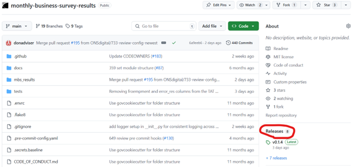
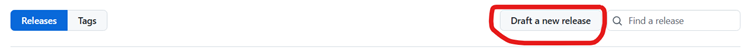
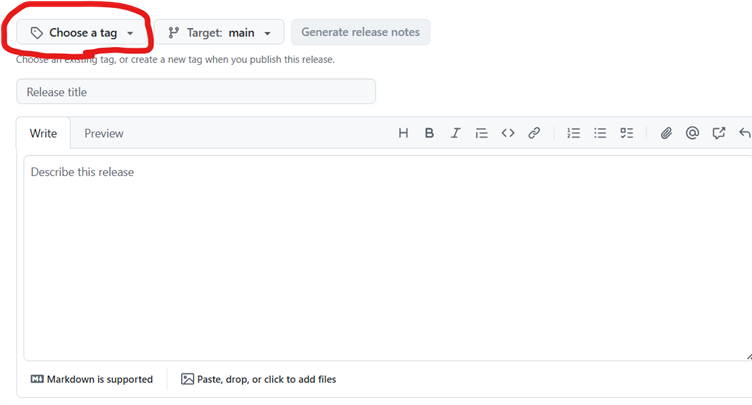

# Contributing

#TODO: update stance on internal/external contribution

We love contributions! We've compiled this documentation to help you understand our
contributing guidelines. [If you still have questions, please contact us][email] and
we'd be happy to help!

## Code of Conduct

[Please read `CODE_OF_CONDUCT.md` before contributing][code-of-conduct].

## Getting started

To start contributing, open your terminal, and install the required Python packages,
and [pre-commit hooks][pre-commit] using:

```shell
pip install -r requirements.txt
pip install -r requirements-dev.txt
pre-commit install
```

or the `make` command:

```shell
make requirements
```

The pre-commit hooks are a security feature to ensure, for example, no secrets[^1],
large data files, and Jupyter notebook outputs are accidentally committed into the
repository. [For more information on pre-commit hooks see our
documentation][docs-pre-commit-hooks].

[^1]: [Only secrets of specific patterns are detected by the pre-commit
      hooks][docs-pre-commit-hooks-secrets-definition].

## Code conventions

Code written for this project should follow [PEP 8 coding conventions][pep8], [project naming conventions][docs-naming] and the guidance on [quality assurance of code for analysis and research][duck-book] (also known as the Duck Book).

### Git and GitHub

We use Git to version control the source code and out source code is stored on
GitHub.

We follow the [GitHub flow][github-flow] workflow. This means that we create
feature branches of the `main` branch and merge them back to `main` once they
meet the definition of done. We give our branches short but informative names,
in lowercase and separated with hypens. Where applicable, we start branch names
with the respective Jira ticket number. For example,
`318-forward-matched-pairs`.

We commit regularly, with distinct chunks of work where possible. We write
short but informative commit messages, starting with a capitalised
present-tense verb, for example `Add`, `Fix`. When pair-programming, we
[add co-authors to the commit][git-coauthor]. We add
[longer commit messages][long-commit] for larger or more complex commits, for
example (squash) merge commits.

We open a pull request to `main` once we have working code that meets a user
need, for example meets the definition of done on the Jira ticket. Pull
requests must be reviewed by at least one member of the team before merging.
Reviews should follow the [pull request template][pr-template]. If we want review on code that does not yet meet the definition of done, we open a draft
pull request. Once a branch has been reviewed, it can be merged. We prefer to use squash merges, in order to simplify the `main` branch commit history. After merging the feature branch should be deleted.

### Functions

We prefer writing functions over classes to make it easier for beginners to understand the code. [Type hints][typing] should be used when writing functions. We prefer functions to return `pandas.DataFrame` rather than `pandas.Series`, for example when deriving new (temporary) variables.

### Markdown

Local links can be written as normal, but external links should be referenced at the
bottom of the Markdown file for clarity. For example:

Use a [local link to reference the `README.md`](../../README.md) file, but [an external
link for GOV.UK][gov-uk].

We also try to wrap Markdown to a line length of 88 characters, but this is not
strictly enforced in all cases, for example with long hyperlinks.

## Testing

[Tests are written using the `pytest` framework][pytest], with its configuration in the
`pyproject.toml` file. Note, only tests in the `tests` folder are run. To run the
tests, enter the following command in your terminal:

```shell
pytest
```
Our testing approach is:
- use `.csv` files containing simple minimal input and output data for a function to be tested
- individual test cases should be separated into different `.csv` files and grouped into folders
- the name of the test data `.csv` files should reflect the test case and the folder name should be the same as the module/function

### Code coverage

[Code coverage of Python scripts is measured using the `coverage` Python
package][coverage]; its configuration can be found in `pyproject.toml`. Note coverage
only extends to Python scripts in the `src` folder.

To run code coverage, and view it as an HTML report, enter the following command in
your terminal:

```shell
coverage run -m pytest
coverage html
```

or use the `make` command:

```shell
make coverage_html
```

The HTML report can be accessed at `htmlcov/index.html`.

## Creating a new release
### Updating the version number

1.	Create a new branch.
2.	Update the version in setup.cfg.
3.	Create a new pull request for your branch, and, once reviewed by somebody, merge it into main.

### Creating a new tag
4.	From the main branch, you need to use the following git commands to create a new tag:

      `git tag -a v<version_num> -m "v<version_num>"` – for example, `git tag -a v0.1.4 -m “v0.1.4”`

      `git push origin v<version_num>` – for example, `git push origin v0.1.4`

      **Note** – if you make a mistake, you can use the command `git tag -d v<version_num>` to delete the tag.

### Creating the release
5.	From the repo, click on the Releases heading along the right hand-side.



6. Click "draft new release" along the top.



7. Under the “Choose a tag” dropdown menu, select the new tag you’ve created.



8.	Click “Generate release notes” OR write your own release notes describing what’s changed in this new version.
9.	Select whether you want to set this as a pre-release or the latest release – generally, we set it as the latest release (but there may be use cases in the future where pre-release could be used).
10.	Click “Publish Release”.

### To check the status of the release
11.	Log into Jenkins using your Windows Credentials.
12.	If you have access, you should see the business-survey-statistics project on your Jenkins dashboard. Click on it, and then click into monthly-business-survey-results.

(**Note:** the rest of this documentation needs updating with the Jenkins-specific steps)


## Documentation

[We write our documentation in MyST Markdown for use in Sphinx][myst]. This is mainly
stored in the `docs` folder, unless it's more appropriate to store it elsewhere, like
this file.

[Please read our guidance on how to write accessible
documentation][docs-write-accessible-documentation], as well as our [guidance on
writing Sphinx documentation][docs-write-sphinx-documentation]. This allows you to
build the documentation into an accessible, searchable website.

[code-of-conduct]: ./CODE_OF_CONDUCT.md
[coverage]: https://coverage.readthedocs.io/
[docs-pre-commit-hooks]: ./pre_commit_hooks.md
[docs-pre-commit-hooks-secrets-definition]: ./pre_commit_hooks.md#definition-of-a-secret-according-to-detect-secrets
[docs-updating-gitignore]: ./updating_gitignore.md
[docs-write-accessible-documentation]: ./writing_accessible_documentation.md
[docs-write-sphinx-documentation]: ./writing_sphinx_documentation.md
[docs-naming]: ../user_guide/naming_conventions.md
[pr-template]: ../../.github/pull_request_template.md
[gds-way]: https://gds-way.cloudapps.digital/
[gds-way-git]: https://gds-way.cloudapps.digital/standards/source-code.html
[gds-way-python]: https://gds-way.cloudapps.digital/manuals/programming-languages/python/python.html#python-style-guide
[myst]: https://myst-parser.readthedocs.io/
[pre-commit]: https://pre-commit.com
[pytest]: https://docs.pytest.org/
[gov-uk]: https://www.gov.uk/
[email]: mailto:organisation@email.address
[pep8]: https://peps.python.org/pep-0008/
[duck-book]: https://best-practice-and-impact.github.io/qa-of-code-guidance/intro.html
[github-flow]: https://docs.github.com/en/get-started/using-github/github-flow
[git-coauthor]: https://docs.github.com/en/pull-requests/committing-changes-to-your-project/creating-and-editing-commits/creating-a-commit-with-multiple-authors
[long-commit]: https://tbaggery.com/2008/04/19/a-note-about-git-commit-messages.html
[typing]: https://docs.python.org/3/library/typing.html
